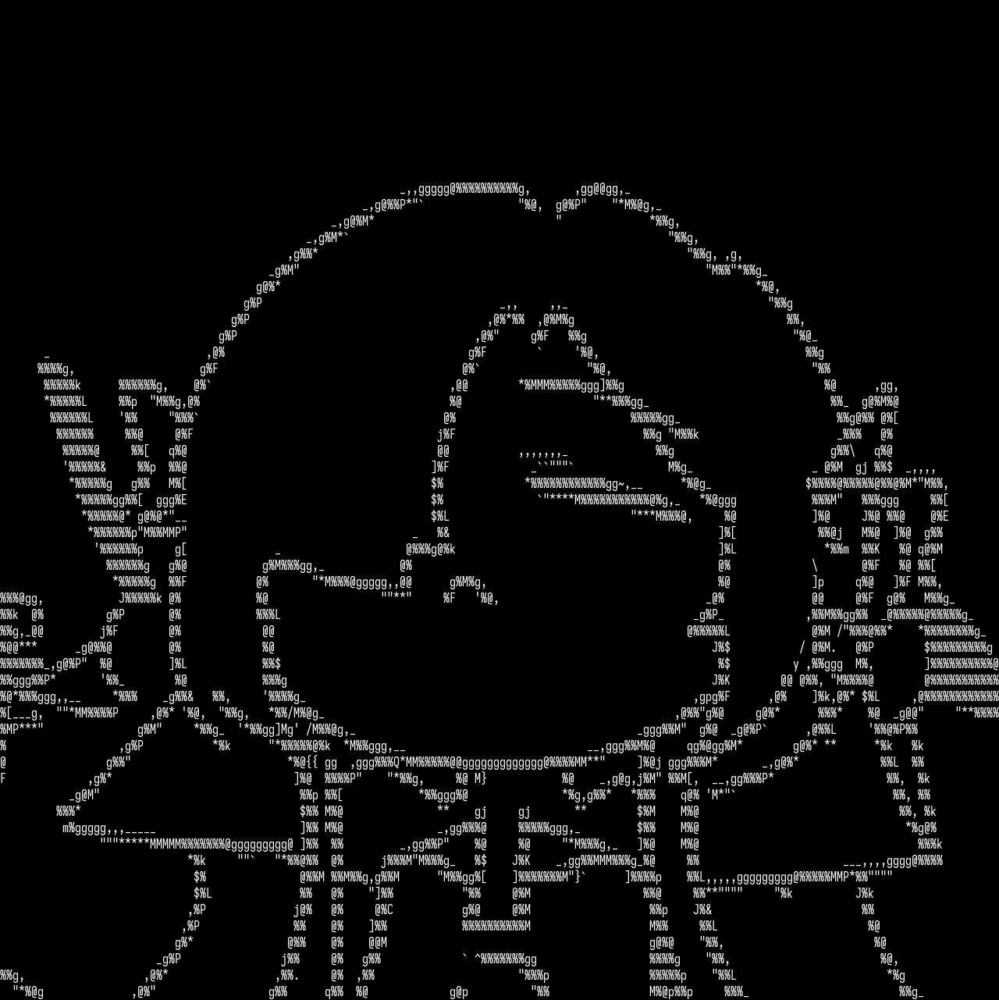

# ena-ascii
A simple texture-aware ASCII art generator. Named after [_Ena Shinonome_](https://pjsekai.sega.jp/character/unite05/ena/index.html) from [_Project Sekai_](https://pjsekai.sega.jp/).

## Requirements
- Python 3.?
- PIL

## Usage
- `genFont.py`: reads a specified font and stores images of characters in `assets\fontpic\`
- `genPic.py inputImage [width]`: resizes an image file (optional) and make an ascii art, storing into `output\`

## How this work
- convert images of glyphs into gray level matrices, elements ranging from 0 _(black)_ to 255 _(white)_
- slice `inputImage` into integral parts _(after resizing and negating, if necessary)_ and convert it into a matrix too
- treat aforementioned matrices as vectors, calculate dot product character-wise and accept the glyph with highest score

## Samples
| Sample Image | Convert Result |
| ----------- | ----------- |
|  |  |
- using [be5invis/Iosevka](https://github.com/be5invis/Iosevka) with `fontSize=16`
- resized from 640x640 to 1280x1281

## References
- Sample image: https://www.pixiv.net/en/artworks/101652094
